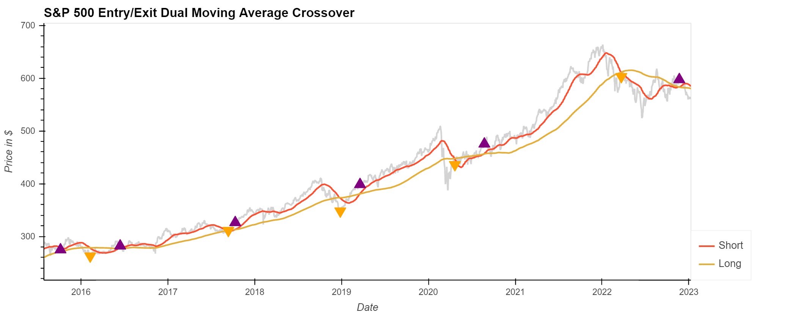
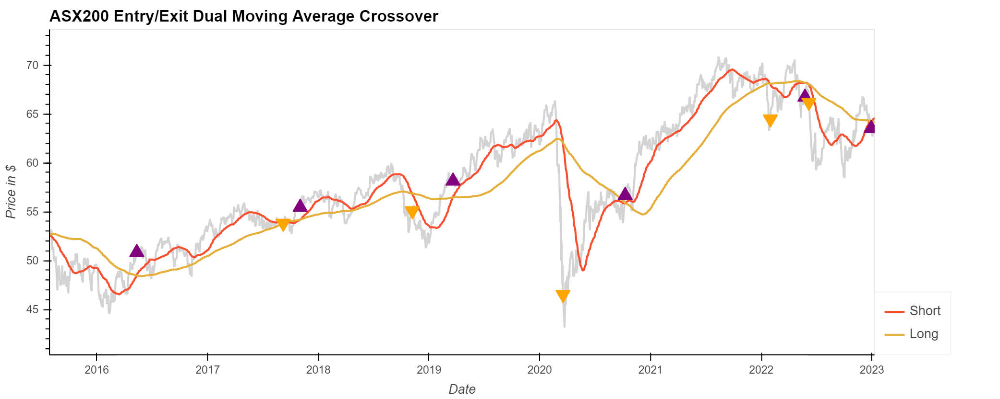
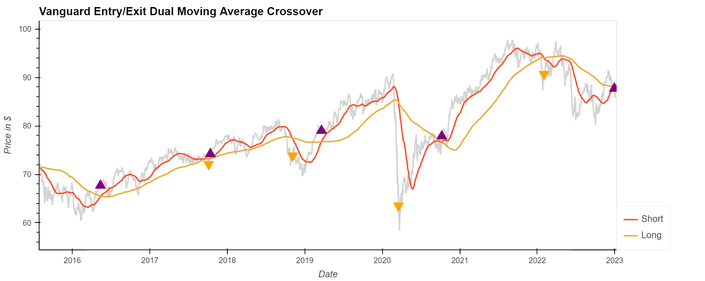
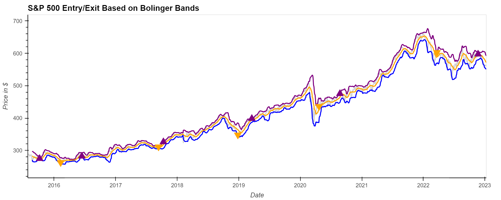
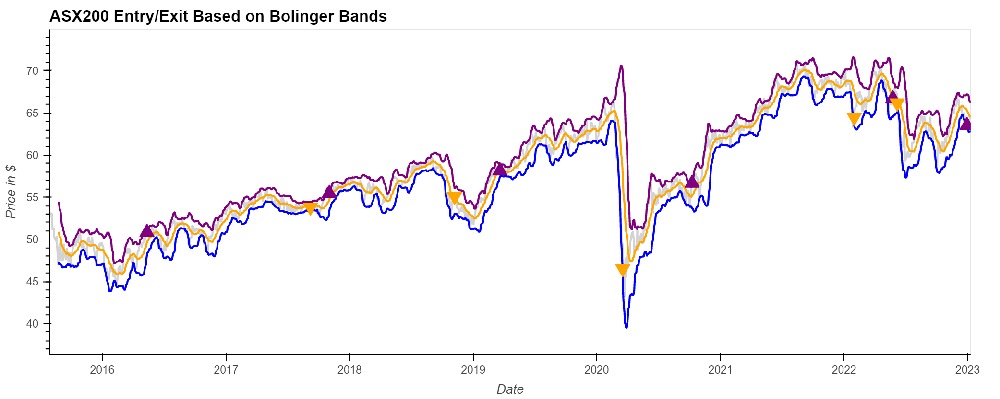
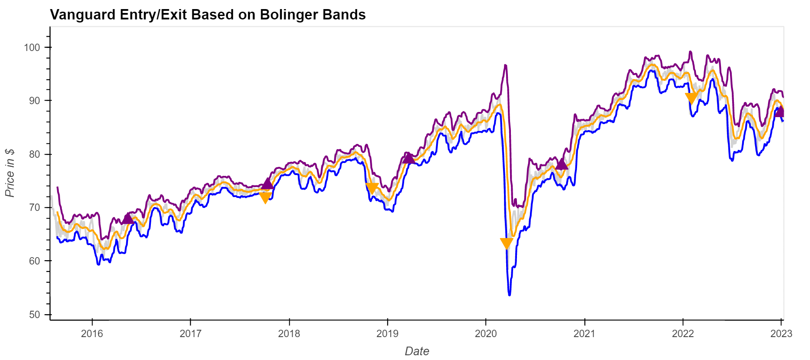
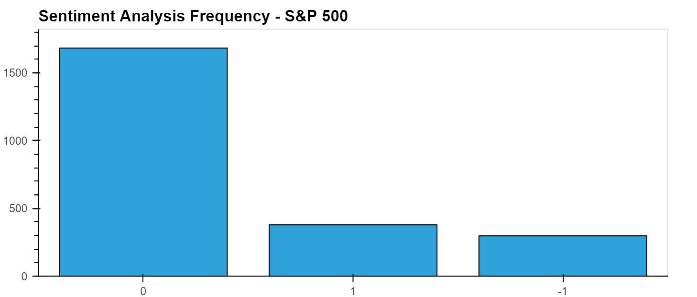
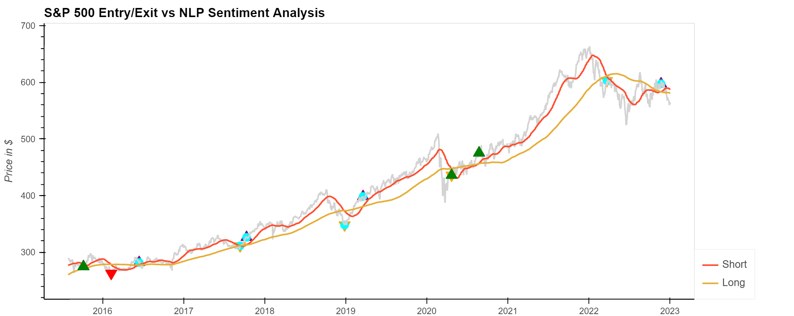

# Introduction
 Stock traders repeatedly analyse stock market historical price movements and related News for calculated trading. Manually analysing this data has become impractical, hence investors ask for a faster method through automation.  By providing large amount of data, machine learning algorithms explore the News sentiment and use the prescribed model to predict the optimum price for trading. 

 <br/>


# Objective
 Build an algorithm evaluating the technical indicators such as 'Dual moving average crossover' and 'Bollinger Bands' indicator and use 'Natural Language Processing' to analyze the sentiments of News headlines of key assets underlying the ETFs. Therefore, forecasting the future prices of ETFs.

 <br/>


# Methodology
1. Collect historical data on ETFs that will include features such as closing price, volume, day high and low-price points
2. Evaluate different **Technical indicators** such as Dual Moving Average Crossover, Bollinger Bands and Exponential Moving Average technical Indicators
3. Use **Natural Language Processing** to analyse the News Sentiment of the assets underlying the ETFs. This will include – Named entity recognition to identify the organizations, classifying the sentiments expressed in the texts and adding those sentiments to the machine learning model
4. Merge the algorithms of Technical Indicators with NLP sentiment analysis to ascertain the best possible entry and exit points for ETF Trader. If the Sentiment analysis corresponds with technical indicators then the call will be for strong buy or strong sell. 


# Data

We pulled the daily historical data from Yahoo Finance API and chose 3 Exchange Traded Funds SPY, STW, and VAS (S&P500, S&P/ASX 200, and Vanguard Australian Shares Index) traded in Australia. The time period is from 02/01/2008 to 03/01/2023. The dataset is composed of 6 variables: date, opening price of the day, highest price of the day, lowest price of the day, closing price of the day, traded volume. We used the closing price of the data for our project to calculate the simple moving average of the ETFs

<br/>


# Indicators
We tested Dual Moving Average Crossover Indicator and Bollinger Bands to generate the buying and selling signals. 
> DMA is  based on the idea that when the shorter-term moving average crosses above the longer-term moving average, it is a buy signal, and when the shorter-term moving average crosses below the longer-term moving average, it is a sell signal.

<br/>

> Bollinger Bands indicator consists of a moving average, usually the 20-day moving average, and two standard deviation lines plotted above and below the moving average. These lines create a band around the price of a security, and the width of the band varies based on volatility. The bands are used to indicate overbought and oversold conditions and to identify changes in volatility. When the price of a security is close to the upper band, it is considered overbought, and when it is close to the lower band, it is considered oversold. Additionally, when the Bollinger Bands are expanding, it can indicate increasing volatility, and when they are contracting, it can indicate decreasing volatility.

<br/>

# Dual Moving Average Crossover for entry and exit points
We selected 50 day window as short window and long window of 200 window. This was optimized in relation to the closing prices movement. Changing the short window to anything lower than 50 days made the movement of the short window trend line closer to the closing prices 

<br/>


# Calculate Dual Moving Simple Moving Average Crossover of ETFs

We used Finta (Financial Technical Analysis) Python Library to calculate the Simple moving averages for the ETFs

```
# Calculate SMA short and long window signals based on close price for each ETF
spy_etf_df = etf_new_df['SPY.AX']
spy_etf_df["Short"] = TA.SMA(spy_etf_df, short_window)
spy_etf_df["Long"] = TA.SMA(spy_etf_df, long_window)

spy_etf_df = spy_etf_df.dropna()

```

#### **We set the signal as 1 when the short window is greater than the long window else a signal of -1**

```
spy_etf_df["Signal"] = 0.0

spy_etf_df["Signal"][short_window:] = np.where(
    spy_etf_df["Short"][short_window:] > spy_etf_df["Long"][short_window:], 1.0, 0.0
)

spy_etf_df["Entry/Exit"] = spy_etf_df["Signal"].diff()

spy_etf_df.head()
```
#### ** 

<br/>


### Visualize the results of DMAC as entry and exit points 

After plotting three individual charts for short window, long window, closing prices and moving averages

#### SPY ETF

#### STW ETF

#### VAS ETF


<br/>

# Bollinger Bands for entry and exit points
We used Finta Bollinger Bands Library to use BB indicators and calculate the Upper, Middle and Lower bands. The result was then concatenated with closing price to plot the charts overlayed on each other 

```
# Determine the Bollinger Bands for the Dataset
spy_bbands_df = TA.BBANDS(spy_bb_signals_df)

# Review the DataFrame

spy_bbands_df = spy_bbands_df.dropna()
spy_bbands_df.head()
```
<br/>

### Visualize the results of Bollinger Bands as entry and exit points 
#### SPY ETF


#### STW ETF

#### VAS ETF


<br/>

# Natural Language Processing

We used Natural language processing (NLP) for news sentiment analysis, and followed the following steps: 

1. Collect a dataset of news headlines from Alpaca API News source for the period that matched with the dataset utilized for Indicators. We got the NEWS articles from 01-01-2015 to 03-01-2023

2. Saved the content into a file and used NLP "distilroberta finetuned financial-news-sentiment-analysis" from Financial News, indicating whether they are positive, negative, or neutral in sentiment

3. We identified key stocks by market cap for each ETF to fiter the news and clean the data. Each day had multiple News articles, hence we looked for the highest frequency sentiment analysis to arrive at per day sentiment to be used for the model 

4. Named Entity Recognition: used NER to identify and classify named ETFs for the news headlines 
5. Text summarization, language translation, language generation : These are the tasks that are done post-processing the data, once all the above steps are done
6. Headline of each ETF News article and ran through the NLP to classify either as positive, neutral and negative

7. Assigned the sentiment to the Dual Moving Average Dataframe to arrive at the buy and sell signals

<br/>

# Conclusion
Using Dual Moving Average Indicators with a 50 day short window and 100 day long window, we were able to idenify the entry and exit points for a buy and sell strategy. This was reinforced with NLP sentiment analysis, when NLP buy signal corresponds with DMAC buy signal, it is considered as a strong buy. 

NLP anlaysis returned 80% of the sentiment as neutral while 10% was Positive buy and 10% analysis was Negative sell signal.


<br/>


[Numerical summary]

<br/>

### DMAC and NLP Entry and Exit chart


<br/>


## References

1. [Hugging face](https://huggingface.co/mrm8488/distilroberta-finetuned-financial-news-sentiment-analysis)
2. [ChatGPT](https://chat.openai.com/chat)
3. [Alpaca SDK](https://alpaca.markets/)
4. [Yahoo Finance](https://alpaca.markets/)
